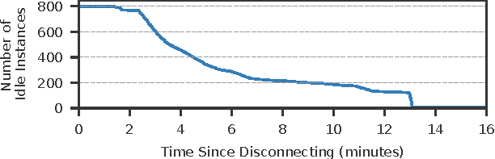
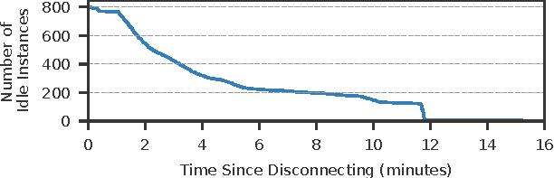

## Description
There was a mistake in the making of Figure 6 in the main paper.
The mistake was that we used "Time since connection" instead of "Time since disconnection" in the x-axis. As a result, the figure is off in the x-axis direction by a fixed offset of about 78s.
As a result, these containers are terminated in 12 minutes after disconnecting,
instead of 13 minutes.

### Figure 6 Before Correction

### Figure 6 After Correction

